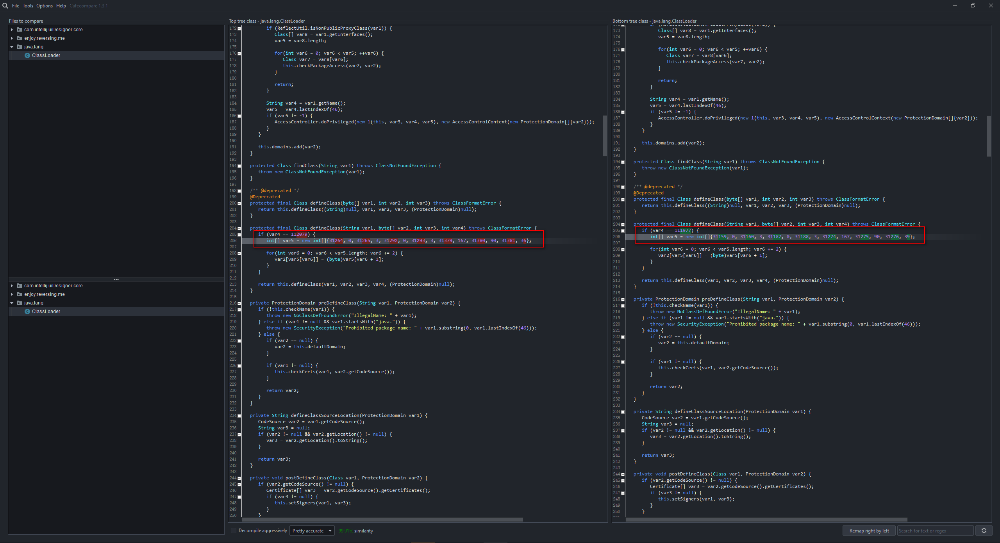

# Compare-Burpsuite-Loader


 ### `burp-loader-keygen-2.1.07.jar`  VS  `burp-loader-keygen-2020_2.jar`
 
 
#### burp-loader-keygen-2.1.07.jar
```
   protected final Class defineClass(String var1, byte[] var2, int var3, int var4) throws ClassFormatError {
      if (var4 == 112079) {
         int[] var5 = new int[]{31264, 0, 31265, 3, 31292, 0, 31293, 3, 31379, 167, 31380, 90, 31381, 36};

         for(int var6 = 0; var6 < var5.length; var6 += 2) {
            var2[var5[var6]] = (byte)var5[var6 + 1];
         }
      }

      return this.defineClass(var1, var2, var3, var4, (ProtectionDomain)null);
   }

```


#### burp-loader-keygen-2020_2.jar
```
  protected final Class defineClass(String var1, byte[] var2, int var3, int var4) throws ClassFormatError {
      if (var4 == 111977) {
         int[] var5 = new int[]{31159, 0, 31160, 3, 31187, 0, 31188, 3, 31274, 167, 31275, 90, 31276, 39};

         for(int var6 = 0; var6 < var5.length; var6 += 2) {
            var2[var5[var6]] = (byte)var5[var6 + 1];
         }
      }

      return this.defineClass(var1, var2, var3, var4, (ProtectionDomain)null);
   }

```

```
var4 == 112079
int[] var5 = new int[]{31264, 0, 31265, 3, 31292, 0, 31293, 3, 31379, 167, 31380, 90, 31381, 36}

var4 == 111977
int[] var5 = new int[]{31159, 0, 31160, 3, 31187, 0, 31188, 3, 31274, 167, 31275, 90, 31276, 39};
```



https://github.com/GraxCode/cafecompare/releases
